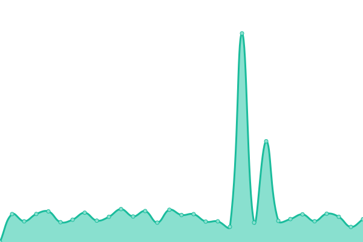
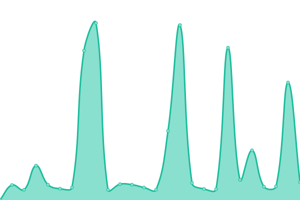
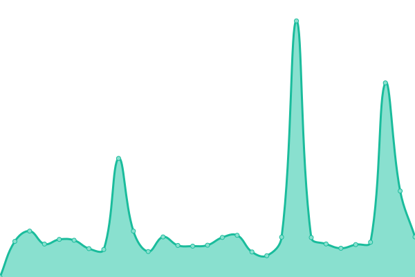

# [📈 Live Status](https://up.itove.com): <!--live status--> **🟩 All systems operational**

This repository contains the open-source uptime monitor and status page for [Upptime](https://upptime.js.org), powered by [Upptime](https://github.com/upptime/upptime).

With [Upptime](https://upptime.js.org), you can get your own unlimited and free uptime monitor and status page, powered entirely by a GitHub repository. We use [Issues](https://github.com/upptime/upptime/issues) as incident reports, [Actions](https://github.com/alzee/up/actions) as uptime monitors, and [Pages](https://up.itove.com) for the status page.

<!--start: status pages-->
<!-- This summary is generated by Upptime (https://github.com/upptime/upptime) -->
<!-- Do not edit this manually, your changes will be overwritten -->
<!-- prettier-ignore -->
| URL | Status | History | Response Time | Uptime |
| --- | ------ | ------- | ------------- | ------ |
|  [itove.com](https://itove.com) | 🟩 Up | [itove-com.yml](https://github.com/alzee/up/commits/HEAD/history/itove-com.yml) | 

 694ms
     
 | 

<a href="https://up.itove.com/history/itove-com">99.86%</a>
    

|  [img.itove.com](https://img.itove.com) | 🟩 Up | [img-itove-com.yml](https://github.com/alzee/up/commits/HEAD/history/img-itove-com.yml) | 

 1232ms
     
 | 

<a href="https://up.itove.com/history/img-itove-com">99.79%</a>
    

|  [zhibao.itove.com](https://zhibao.itove.com) | 🟩 Up | [zhibao-itove-com.yml](https://github.com/alzee/up/commits/HEAD/history/zhibao-itove-com.yml) | 

 847ms
     
 | 

<a href="https://up.itove.com/history/zhibao-itove-com">99.86%</a>
    

|  [alz.ee](https://alz.ee) | 🟩 Up | [alz-ee.yml](https://github.com/alzee/up/commits/HEAD/history/alz-ee.yml) | 

 547ms
     
 | 

<a href="https://up.itove.com/history/alz-ee">100.00%</a>
    

|  [syzszz.cn](https://syzszz.cn) | 🟩 Up | [syzszz-cn.yml](https://github.com/alzee/up/commits/HEAD/history/syzszz-cn.yml) | 

 1059ms
     
 | 

<a href="https://up.itove.com/history/syzszz-cn">99.81%</a>
    

|  [m.syzszz.cn](https://m.syzszz.cn) | 🟩 Up | [m-syzszz-cn.yml](https://github.com/alzee/up/commits/HEAD/history/m-syzszz-cn.yml) | 

 1176ms
     
 | 

<a href="https://up.itove.com/history/m-syzszz-cn">99.76%</a>
    

|  [fxkyss.com](https://fxkyss.com) | 🟩 Up | [fxkyss-com.yml](https://github.com/alzee/up/commits/HEAD/history/fxkyss-com.yml) | 

 918ms
     
 | 

<a href="https://up.itove.com/history/fxkyss-com">99.72%</a>
    

|  [hbljk.cn](https://hbljk.cn) | 🟩 Up | [hbljk-cn.yml](https://github.com/alzee/up/commits/HEAD/history/hbljk-cn.yml) | 

 1616ms
     
 | 

<a href="https://up.itove.com/history/hbljk-cn">100.00%</a>
    

|  [gjj.itove.com](https://gjj.itove.com) | 🟩 Up | [gjj-itove-com.yml](https://github.com/alzee/up/commits/HEAD/history/gjj-itove-com.yml) | 

 1404ms
     
 | 

<a href="https://up.itove.com/history/gjj-itove-com">99.87%</a>
    

|  [stamp.itove.com](https://stamp.itove.com) | 🟩 Up | [stamp-itove-com.yml](https://github.com/alzee/up/commits/HEAD/history/stamp-itove-com.yml) | 

 836ms
     
 | 

<a href="https://up.itove.com/history/stamp-itove-com">99.87%</a>
    

|  [qstamp.itove.com](https://qstamp.itove.com) | 🟩 Up | [qstamp-itove-com.yml](https://github.com/alzee/up/commits/HEAD/history/qstamp-itove-com.yml) | 

 728ms
     
 | 

<a href="https://up.itove.com/history/qstamp-itove-com">99.88%</a>
    

|  [bounty.itove.com](https://bounty.itove.com) | 🟩 Up | [bounty-itove-com.yml](https://github.com/alzee/up/commits/HEAD/history/bounty-itove-com.yml) | 

 1184ms
     
 | 

<a href="https://up.itove.com/history/bounty-itove-com">99.88%</a>
    

|  [music.itove.com](https://music.itove.com) | 🟩 Up | [music-itove-com.yml](https://github.com/alzee/up/commits/HEAD/history/music-itove-com.yml) | 

 1363ms
     
 | 

<a href="https://up.itove.com/history/music-itove-com">7.26%</a>
    

|  [www.sygrdyf.com](http://www.sygrdyf.com) | 🟩 Up | [www-sygrdyf-com.yml](https://github.com/alzee/up/commits/HEAD/history/www-sygrdyf-com.yml) | 

 914ms
     
 | 

<a href="https://up.itove.com/history/www-sygrdyf-com">99.89%</a>
    

<!--end: status pages-->

[**Visit our status website →**](https://up.itove.com)

## 📄 License

- Powered by: [Upptime](https://github.com/upptime/upptime)
- Code: [MIT](./LICENSE) © [Upptime](https://upptime.js.org)
- Data in the `./history` directory: [Open Database License](https://opendatacommons.org/licenses/odbl/1-0/)
